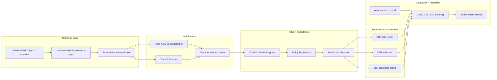
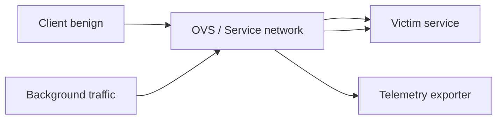
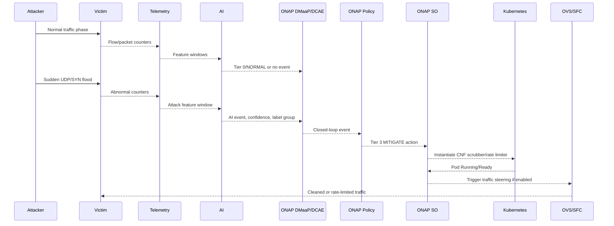
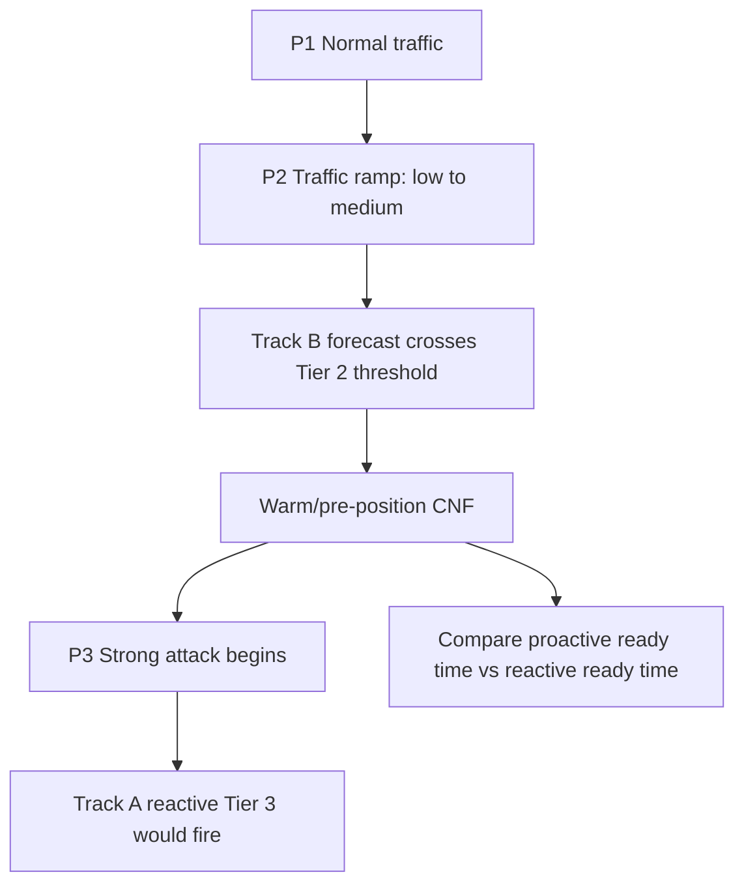
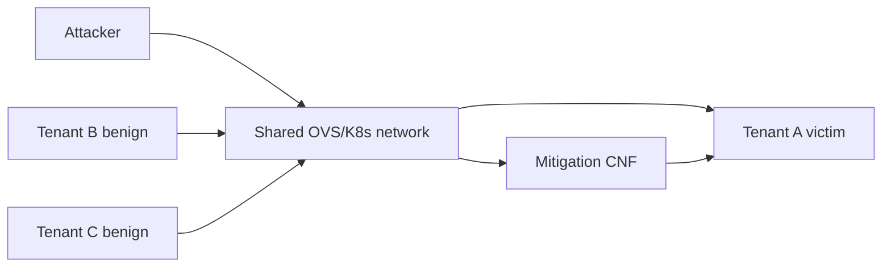

# PAD-ONAP Pipeline

## Kich ban danh gia bang ONAP + Kubernetes that

Tai lieu nay mo ta kich ban chay va danh gia PAD-ONAP khi da co ONAP OOM va
Kubernetes that. Day la tai lieu thiet ke kich ban, khong phai ket qua da chay.
Moi thong so latency, do chinh xac, throughput, SLA violation va hieu qua giam
thieu tan cong phai duoc lay tu file ket qua sau khi chay test. Neu chua co
ket qua, ghi ro `Result pending`.

## 1. Muc tieu

Muc tieu cua pipeline la kiem chung mot closed-loop DDoS defense co day du cac
thanh phan:

1. Thu thap telemetry tu traffic that hoac traffic testbed.
2. Suy luan AI theo hai track:
   - Track A: phat hien tuc thoi bang XGBoost.
   - Track B: du bao som bang LSTM/Transformer neu model hop le.
3. Chuyen AI event sang ONAP DCAE/DMaaP/Policy.
4. ONAP Policy ra quyet dinh tier.
5. ONAP SO yeu cau vong doi CNF/VNF.
6. Kubernetes tao, scale, xoa CNF.
7. Data plane chuyen huong traffic qua CNF neu kich ban co SFC/OVS.
8. Ghi lai toan bo timestamp va metric de so sanh baseline chua co AI voi PAD-ONAP co AI.

Rang buoc bat buoc:

- Khong retrain model trong kich ban nay.
- Khong tu tao metric.
- Khong mo ta mock/dry-run nhu ket qua ONAP/K8s that.
- Neu chua co ONAP, K8s, model, CNF image, descriptor hoac ket qua chay that,
  phai danh dau la pending.

## 2. Dinh nghia "real ONAP + K8s"

Trong tai lieu nay, "real ONAP + K8s" co nghia:

- `PAD_ONAP_STUB=false`.
- Khong dung mock Policy, mock SO, mock K8s adapter.
- ONAP OOM dang chay tren Kubernetes.
- ONAP SO, Policy, DMaaP/DCAE duoc goi qua endpoint that.
- CNF mitigation duoc tao tren Kubernetes bang ONAP SO hoac bang adapter duoc
  phep noi truc tiep voi Kubernetes neu kich ban ghi ro.
- Ket qua latency duoc do tu timestamp that, khong lay tu sleep gia lap.

Co hai muc thuc nghiem:

| Muc | Ten | Mo ta | Duoc dung cho bao cao that? |
|---|---|---|---|
| R0 | Dry-run | Sinh payload, khong goi ONAP/K8s | Khong, chi dung de debug |
| R1 | Real control plane | ONAP + K8s that, traffic co the tu Mininet/test host | Co, neu ghi ro data plane la testbed |
| R2 | Full real testbed | ONAP + K8s + CNF + traffic steering/SFC that | Co, day la muc mong muon nhat |

Neu chay R1 voi Mininet de tao traffic, phai goi la "real ONAP/K8s control
plane with Mininet data-plane testbed", khong goi la mang san xuat.

## 3. Kien truc muc cao



## 4. Thanh phan bat buoc

| Nhom | Thanh phan | Vai tro | Trang thai truoc khi chay |
|---|---|---|---|
| Kubernetes | Cluster, namespace `onap`, namespace `pad-onap` | Chay ONAP va pipeline | Pending until installed |
| ONAP | SO | Tao/scale/terminate CNF/VNF | Pending until installed |
| ONAP | Policy PAP/PDP | Danh gia tier policy | Pending until installed |
| ONAP | DMaaP/DCAE | Nhan AI event | Pending until installed |
| PAD pipeline | Telemetry collector | Tao feature tu traffic | Can verify |
| PAD pipeline | Track A model | Phat hien grouped DDoS labels | User-provided model results required |
| PAD pipeline | Track B model | Du bao som | Pending if NaN or not validated |
| Enforcement | CNF rate limiter | Tier 2/Tier 3 nhe | Pending CNF image/chart |
| Enforcement | CNF scrubber | Tier 3/Tier 4 | Pending CNF image/chart |
| Enforcement | OVS/SFC rule | Chuyen traffic qua CNF | Optional but needed for full R2 |
| Result layer | JSON, CSV, figures, LaTeX tables | Bao cao thesis | Generated only after real run |

## 5. AI event schema can co

Moi output tu AI phai gom it nhat cac truong sau:

| Field | Y nghia |
|---|---|
| `event_id` | ID duy nhat cua event |
| `timestamp_utc` | Thoi diem AI tao event |
| `run_id` | ID lan chay |
| `mode` | `baseline`, `ai`, `dry_run`, `real_onap_k8s` |
| `track_a.label_group` | Nhan 5-class production |
| `track_a.original_label` | Nhan goc 12-class neu co, chi dung audit |
| `track_a.confidence` | Xac suat/confidence cua Track A |
| `track_b.p_t1` | Xac suat du bao ngan han neu co |
| `track_b.p_t5` | Xac suat du bao 5 phut neu co |
| `track_b.p_t15` | Xac suat du bao 15 phut neu co |
| `tier` | Tier da quyet dinh |
| `action` | Hanh dong policy |
| `target` | Tenant, prefix, service hoac victim |
| `xai` | SHAP/top features neu co |

Track A production labels:

| Production label | Nhan goc gom vao |
|---|---|
| `BENIGN` | BENIGN |
| `DrDoS_Reflection` | DNS, LDAP, MSSQL, NetBIOS, NTP, SNMP, SSDP reflection |
| `Syn` | Syn |
| `UDP_based_attack` | UDP, UDP-lag |
| `WebDDoS` | WebDDoS |

Nhan goc 12-class chi dung cho audit/reporting. Quyet dinh policy khong duoc
dua truc tiep tren 12-class neu pipeline da chuan hoa sang 5-class.

## 6. Tier decision logic

| Tier | Ten | Dieu kien | Hanh dong |
|---|---|---|---|
| 0 | NORMAL | Khong co tin hieu tan cong | Giam sat binh thuong |
| 1 | ALERT | Track B canh bao som hoac tin hieu nhe | Tang sampling, log event, cap nhat context |
| 2 | PREEMPT | Forecast kha cao, chua can chen traffic | Pre-position/warm CNF, chuan bi quota |
| 3 | MITIGATE | Track A confidence cao hoac forecast ngan han cao | Chen rate limiter/scrubber vao path |
| 4 | ISOLATE | Confidence rat cao hoac traffic gay mat SLA nghiem trong | Scrubbing manh, blackhole prefix neu duoc phep |

Nguyen tac:

- Tier chi duoc tang neu tin hieu vuot nguong da dinh nghia.
- Tier 2 la diem khac biet chinh cua proactive defense: chuan bi CNF truoc khi
  attack that su gay mat dich vu.
- Tier 3 co hai duong vao: reactive tu Track A va proactive tu Track B ngan han.
- Giam tier chi duoc thuc hien sau cooldown va khi xac suat tan cong thap on dinh.
- Moi thay doi tier phai ghi timestamp va ly do.

## 7. Kich ban so sanh chinh

Khi chay that, can chay it nhat hai che do tren cung mot topology, cung attack
script va cung thoi luong:

| Che do | Ten | AI | Policy | Enforcement |
|---|---|---|---|---|
| Baseline | Chua co AI | Tat M2 | Static threshold hoac manual trigger | Van dung ONAP SO + K8s CNF |
| PAD-ONAP AI | Co AI | Bat Track A, Track B neu hop le | Tier policy tu AI event | ONAP SO + K8s CNF |

Muc dich so sanh la co lap tac dong cua AI. Hai che do phai dung cung CNF,
cung ONAP, cung K8s va cung traffic generator. Khac biet duy nhat nen la logic
ra quyet dinh.

## 8. Kich ban S0 - Preflight that

Muc tieu: xac nhan moi thanh phan san sang truoc khi tao traffic tan cong.

Thu tu:

1. Kiem tra Kubernetes context dang tro toi cluster ONAP.
2. Kiem tra namespace `onap` va cac pod ONAP can thiet da `Running/Ready`.
3. Kiem tra namespace `pad-onap` neu pipeline da deploy.
4. Kiem tra endpoint SO, Policy, DMaaP/DCAE.
5. Kiem tra secret/credential duoc cung cap qua bien moi truong hoac Kubernetes Secret.
6. Kiem tra CNF image co the pull tu registry.
7. Kiem tra VNFD/CSAR/Helm chart da onboard vao ONAP SDC/SO.
8. Kiem tra telemetry topic co the publish/consume.
9. Kiem tra model artifact ton tai va dung shape.
10. Ghi ket qua preflight vao `results/real_onap_k8s/<run_id>/preflight.json`.

Dieu kien pass:

- Khong co endpoint chinh nao loi ket noi.
- ONAP SO health pass.
- Policy PAP/PDP health pass.
- DMaaP/DCAE nhan duoc test event.
- Kubernetes co the tao pod test nho trong namespace cho phep.
- Neu bat AI, model phai load duoc va khong sinh NaN.

Neu bat ky muc nao fail, dung o S0 va khong chay attack.

## 9. Kich ban S1 - Normal traffic baseline

Muc tieu: tao duong nen khi khong co tan cong.

Topology de xuat:



Thu tu:

1. Khoi dong victim service.
2. Khoi dong traffic benign bang `iperf3`, HTTP benchmark hoac flow generator.
3. Chay trong 3 den 5 phut de lay baseline throughput, RTT, packet loss.
4. Thu telemetry, tao feature va publish qua pipeline.
5. Xac nhan AI khong sinh Tier 2/3/4 khi khong co attack.
6. Ghi metric baseline vao result file.

Metric can thu:

| Metric | Y nghia | Ket qua |
|---|---|---|
| `baseline_goodput_mbps` | Thong luong hop le khi khong bi tan cong | Result pending |
| `baseline_rtt_ms` | RTT trung binh | Result pending |
| `baseline_packet_loss_pct` | Ti le mat goi | Result pending |
| `false_positive_tier_events` | So lan AI/policy nang tier sai | Result pending |

## 10. Kich ban S2 - Sudden UDP/SYN attack, reactive mitigation

Muc tieu: kiem tra kha nang phat hien tuc thoi va dieu phoi CNF khi attack xuat
hien dot ngot. Day la kich ban can chay dau tien khi ONAP/K8s that da san sang.

Topology logic:



Pha chay:

| Pha | Thoi luong de xuat | Mo ta |
|---|---:|---|
| P1 Normal | 60 s | Benign traffic de lay baseline |
| P2 Attack start | 60 s | Bat UDP flood hoac SYN flood |
| P3 Mitigation | Trong P2 | AI/Policy/SO/K8s kich hoat Tier 3 |
| P4 Recovery | 60 s | Tat attack, theo doi demotion/cleanup |

Baseline chua co AI:

1. Tat Track A/Track B.
2. Dung static threshold, vi du packet rate, byte rate, SYN rate hoac manual trigger.
3. Khi threshold vuot nguong, goi cung ONAP Policy/SO/K8s action nhu AI mode.
4. Ghi timestamp nhu AI mode.

PAD-ONAP AI:

1. Bat Track A.
2. Track A phat hien `Syn` hoac `UDP_based_attack`.
3. Neu confidence vuot nguong Tier 3, publish AI event.
4. Policy tao action `MITIGATE`.
5. SO instantiate `vnfd-scrubber-v1` hoac profile tuong ung.

Metric can thu:

| Metric | Timestamp nguon | Ket qua |
|---|---|---|
| `t_attack_start` | Traffic generator | Result pending |
| `t_feature_ready` | Feature extractor | Result pending |
| `t_ai_event` | AI engine | Result pending |
| `t_policy_decision` | ONAP Policy | Result pending |
| `t_so_request` | ONAP SO client | Result pending |
| `t_cnf_ready` | Kubernetes pod readiness | Result pending |
| `t_sfc_applied` | OVS/SFC adapter, neu co | Result pending |
| `detect_lag_s` | `t_ai_event - t_attack_start` | Result pending |
| `onap_orchestration_ms` | `t_cnf_ready - t_policy_decision` | Result pending |
| `e2e_mitigation_ms` | `t_sfc_applied - t_attack_start` hoac `t_cnf_ready - t_attack_start` | Result pending |
| `goodput_attack_mbps` | Victim measurement | Result pending |
| `packet_loss_attack_pct` | Victim measurement | Result pending |

File ket qua de xuat:

- `evaluation/results/s2_real_onap_baseline_<timestamp>.json`
- `evaluation/results/s2_real_onap_ai_<timestamp>.json`
- `results/real_onap_k8s/<run_id>/s2_summary.json`

## 11. Kich ban S3 - WebDDoS

Muc tieu: kiem tra attack lop ung dung va mapping sang `WebDDoS`.

Thu tu:

1. Chay victim HTTP service trong Kubernetes.
2. Tao benign HTTP workload co request rate on dinh.
3. Tao HTTP flood tu attacker host/pod.
4. Track A phan loai `WebDDoS`.
5. Policy chon rate limiter hoac application-layer limiter.
6. SO tao CNF profile ung voi WebDDoS.
7. Do request success rate, p95 latency, error rate va thoi gian mitigation.

Bang ket qua can co:

| Metric | Baseline no AI | PAD-ONAP AI |
|---|---:|---:|
| Request success rate | Result pending | Result pending |
| HTTP p95 latency | Result pending | Result pending |
| Time to first action | Result pending | Result pending |
| Time to clean traffic | Result pending | Result pending |
| CNF startup latency | Result pending | Result pending |

## 12. Kich ban S4 - Volumetric ramp, proactive Tier 2

Muc tieu: chung minh gia tri cua Track B neu model du bao hop le. Neu Track B
dang sinh NaN hoac chua validate, khong duoc bao cao ket qua proactive; ghi
`Result pending`.

Mo hinh pha:



Thu tu AI mode:

1. Chay normal traffic de lam day history window.
2. Tang dan packet/byte rate nhung chua lam mat SLA nghiem trong.
3. Track B phat `PREEMPT` neu xac suat vuot nguong Tier 2.
4. ONAP Policy yeu cau SO pre-position hoac warm CNF.
5. Khi attack manh xuat hien, Track A phat Tier 3.
6. Vi CNF da warm, action Tier 3 chi can apply steering/scale.
7. Do lead time va latency tiet kiem so voi reactive-only.

Baseline no AI:

1. Khong co Track B.
2. Khong pre-position CNF.
3. Chi khi attack manh vuot static threshold moi instantiate CNF.

Metric can thu:

| Metric | Y nghia | Ket qua |
|---|---|---|
| `t_tier2_preempt` | Thoi diem forecast kich Tier 2 | Result pending |
| `t_tier3_reactive` | Thoi diem reactive Tier 3 se kich hoat | Result pending |
| `lead_time_s` | `t_tier3_reactive - t_tier2_preempt` | Result pending |
| `warm_cnf_ready_ms` | Policy -> CNF warm ready | Result pending |
| `reactive_cnf_ready_ms` | Policy -> CNF ready neu khong warm | Result pending |
| `proactive_latency_delta_ms` | Chenh lech latency | Result pending |

File ket qua de xuat:

- `evaluation/results/s8_real_onap.json`
- `results/real_onap_k8s/<run_id>/s4_or_s8_proactive_summary.json`

## 13. Kich ban S5 - Multi-tenant SLA

Muc tieu: kiem tra he thong co bao ve tenant khong bi tan cong trong khi tenant
khac dang bi DDoS hay khong.

Topology:



Thu tu:

1. Tao ba tenant service hoac ba flow nhom khac nhau.
2. Attack chi danh vao Tenant A.
3. Tenant B/C tiep tuc sinh benign traffic.
4. Policy ap dung mitigation chi cho prefix/service bi tan cong neu co the.
5. Do throughput, RTT va violation cho ca ba tenant.

Metric can thu:

| Metric | Tenant A | Tenant B | Tenant C |
|---|---:|---:|---:|
| Goodput before attack | Result pending | Result pending | Result pending |
| Goodput during attack | Result pending | Result pending | Result pending |
| SLA violation minutes | Result pending | Result pending | Result pending |
| Packet loss during mitigation | Result pending | Result pending | Result pending |

## 14. Kich ban S6 - Cleanup, rollback va failure handling

Muc tieu: dam bao pipeline khong de lai tai nguyen loi sau khi test.

Tinh huong can kiem:

| Tinh huong | Mong doi |
|---|---|
| SO instantiate fail | Ghi error, khong cai la success |
| CNF image pull fail | Ghi ro image/registry loi |
| Policy push fail | Khong goi SFC steering |
| K8s pod khong Ready | Timeout va cleanup |
| Attack da dung | Demotion sau cooldown |
| Cleanup | Xoa policy test, terminate CNF, remove SFC rule |

Moi failure phai co:

- Command/kich ban dang chay.
- Error summary.
- Thanh phan loi: AI, DMaaP, Policy, SO, K8s, SFC, traffic generator.
- Fix instruction.
- Ket qua khong duoc dua vao bang thanh cong.

## 15. Run order de xuat khi cai dat sau

Thu tu nen chay khi moi co moi truong:

1. S0 preflight dry-read: chi kiem tra endpoint va artifact.
2. S1 normal traffic: khong attack, xac nhan khong false positive.
3. S2 baseline no AI: sudden attack voi static/manual policy.
4. S2 PAD-ONAP AI: cung sudden attack, bat Track A.
5. S3 WebDDoS neu co victim HTTP service.
6. S4/S8 proactive neu Track B da het NaN va duoc validate.
7. S5 multi-tenant SLA.
8. S6 cleanup/failure handling.

Khong nen chay S4/S8 de bao cao proactive neu Track B chua on dinh.

## 16. Result schema de bao cao

Moi run that nen co mot `run_id` va thu muc rieng:

```text
results/real_onap_k8s/<run_id>/
  metadata.json
  preflight.json
  events.jsonl
  orchestration_timestamps.json
  traffic_metrics.json
  cnf_lifecycle.json
  summary.json
  figures/
  tables/
```

`metadata.json` bat buoc co:

| Field | Mo ta |
|---|---|
| `run_id` | ID duy nhat |
| `timestamp_utc` | Thoi diem bat dau |
| `mode` | `baseline_no_ai` hoac `pad_onap_ai` |
| `onap_mode` | `real` |
| `k8s_context` | Ten context, khong ghi secret |
| `onap_namespace` | Namespace ONAP |
| `pad_namespace` | Namespace pipeline |
| `git_commit` | Commit repo neu co |
| `source_file` | Script/kich ban da chay |
| `model_artifacts` | Ten file model, hash neu co |
| `notes` | Ghi chu |

`summary.json` nen co cac nhom:

```json
{
  "run_id": "pending",
  "mode": "baseline_no_ai or pad_onap_ai",
  "scenario": "S2_sudden_udp_or_syn",
  "status": "pending",
  "classification": {
    "label_group": "pending",
    "confidence": null
  },
  "latency": {
    "detect_lag_s": null,
    "policy_ms": null,
    "so_to_cnf_ready_ms": null,
    "sfc_apply_ms": null,
    "e2e_mitigation_ms": null
  },
  "traffic": {
    "baseline_goodput_mbps": null,
    "attack_goodput_mbps": null,
    "recovery_goodput_mbps": null,
    "packet_loss_pct": null
  },
  "sla": {
    "violation_minutes": null
  }
}
```

Gia tri `null` la hop le khi chua co ket qua. Khong thay bang so uoc luong.

## 17. Bang so sanh de dua vao thesis

Bang 1 - Baseline vs PAD-ONAP AI cho S2:

| Metric | Baseline no AI | PAD-ONAP AI | Source |
|---|---:|---:|---|
| Time to first action | Result pending | Result pending | result JSON |
| Detection lag | Result pending | Result pending | result JSON |
| ONAP orchestration latency | Result pending | Result pending | result JSON |
| CNF ready latency | Result pending | Result pending | K8s event/result JSON |
| E2E mitigation latency | Result pending | Result pending | result JSON |
| Goodput during attack | Result pending | Result pending | traffic_metrics.json |
| Packet loss during attack | Result pending | Result pending | traffic_metrics.json |

Bang 2 - Proactive benefit cho S4/S8:

| Metric | Reactive-only | Proactive PAD-ONAP | Source |
|---|---:|---:|---|
| CNF preparation start | Result pending | Result pending | events.jsonl |
| CNF ready before attack | Result pending | Result pending | cnf_lifecycle.json |
| Lead time | Result pending | Result pending | summary.json |
| Latency saved | Result pending | Result pending | summary.json |
| SLA violation minutes | Result pending | Result pending | traffic_metrics.json |

Bang 3 - CNF lifecycle:

| CNF | Action | p50 ready | p95 ready | CPU peak | RAM peak | Source |
|---|---|---:|---:|---:|---:|---|
| Rate limiter | Instantiate/scale | Result pending | Result pending | Result pending | Result pending | K8s metrics |
| Scrubber | Instantiate/scale | Result pending | Result pending | Result pending | Result pending | K8s metrics |

## 18. Noi dung nen viet trong thesis

Duoc viet:

- "The real ONAP/Kubernetes scenario is designed to measure closed-loop latency
  from AI event generation to CNF readiness and optional SFC application."
- "Baseline mode disables AI decision-making while keeping the same ONAP/K8s
  enforcement path."
- "Mock and dry-run outputs are used only for debugging and are not reported as
  real ONAP/Kubernetes results."
- "Model metrics are pending until user-provided training results are inserted."

Khong duoc viet neu chua co ket qua:

- Khong ghi ONAP latency bang so neu chua co file result.
- Khong noi PAD-ONAP nhanh hon baseline neu chua chay A/B.
- Khong noi Track B proactive thanh cong neu LSTM/Transformer con NaN.
- Khong noi da enforce tren K8s neu chi moi dry-run payload.

## 19. Dieu kien hoan thanh cho real-mode experiment

Mot experiment duoc xem la hop le de bao cao khi:

1. Co `metadata.json` voi `onap_mode=real`.
2. Co log/preflight cho thay ONAP SO, Policy, DMaaP/DCAE reachable.
3. Co AI event hoac baseline trigger duoc ghi timestamp.
4. Co ONAP Policy decision hoac SO request log.
5. Co Kubernetes pod lifecycle event cho CNF.
6. Co traffic metric truoc, trong va sau attack.
7. Co cleanup log.
8. Cung mot scenario duoc chay ca baseline no AI va PAD-ONAP AI neu muon so sanh.
9. Tat ca bang/figure trong thesis duoc generate tu result files.
10. Cac ket qua thieu duoc ghi `Result pending`.

## 20. Mapping voi file hien co trong repository

| File/thu muc | Vai tro trong kich ban |
|---|---|
| `onap/DEPLOY.md` | Huong dan cai ONAP/K8s legacy |
| `onap/DEPLOY_PRODUCTION.md` | Runbook production-like cho real ONAP/K8s |
| `onap/scripts/preflight_check.py` | Kiem tra endpoint ONAP va artifact |
| `onap/scripts/run_s2_real.py` | Kich ban S2 real ONAP |
| `onap/scripts/run_s8_real.py` | Kich ban proactive T2 vs reactive T3 |
| `pipeline/s4_orchestration/onap_so_client.py` | SO/Helm/ONAP deployment client |
| `testbed/netflow_e2e_pipeline.py` | E2E traffic/telemetry pipeline cho testbed |
| `results/real_onap_k8s/` | Noi luu ket qua real ONAP/K8s |
| `evaluation/results/` | Noi mot so script hien tai ghi JSON/PNG |

Neu sau nay cai dat va chay that, nen uu tien cap nhat script de moi ket qua
real ONAP/K8s deu duoc copy ve `results/real_onap_k8s/<run_id>/` de thesis doc
duoc tu mot noi thong nhat.

