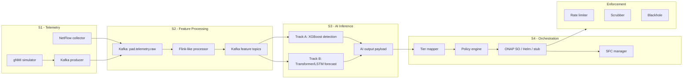

# PAD-ONAP: Proactive DDoS Defense Pipeline

PAD-ONAP là project thử nghiệm closed-loop defense cho DDoS, kết hợp telemetry từ testbed, xử lý đặc trưng theo cửa sổ, suy luận AI hai track, ánh xạ tier chính sách, và orchestration qua ONAP/Kubernetes hoặc stub/Helm trong môi trường nghiên cứu.

Project phục vụ các mục tiêu chính:

- Thu thập telemetry từ gNMI, NetFlow/IPFIX hoặc traffic Mininet.
- Chuyển telemetry thô thành feature window phục vụ phát hiện và dự báo.
- Chạy AI hai track:
  - Track A: phát hiện tức thời bằng XGBoost.
  - Track B: dự báo sớm bằng LSTM/Transformer khi model hợp lệ.
- Sinh event AI theo schema thống nhất để đưa vào policy/orchestration.
- Ra quyết định tier 0-4 và kích hoạt mitigation bằng VNF/CNF.
- Đánh giá baseline so với PAD-ONAP AI bằng các kịch bản S1-S8/S9.

## Kiến Trúc Tổng Quan



## Cấu Trúc Thư Mục

| Đường dẫn | Vai trò |
|---|---|
| `pipeline/s1_telemetry/` | Producer telemetry từ gNMI sang Kafka. |
| `pipeline/s2_features/` | Processor tạo feature windows cho Track A/Track B. |
| `pipeline/s3_ai/` | Inference engine, live pipeline, payload AI, model logic. |
| `pipeline/s4_orchestration/` | Tier mapping, policy engine, ONAP SO client, SFC, SLA, health/metrics. |
| `testbed/` | Docker Compose, gNMI simulator, NetFlow collector, Mininet E2E scripts. |
| `testbed/mininet/` | Topology Mininet, fat-tree, attack scenarios. |
| `docker/` | VNF container images: scrubber, rate limiter, analyzer, blackhole. |
| `onap/` | Manifest Kubernetes/ONAP, VNFD, CLAMP template, scripts triển khai thật. |
| `evaluation/` | Kịch bản S1-S8/S9, phân tích lead time, baseline, report. |
| `pad_onap_v3/` | Model, scaler, dữ liệu processed, hình kết quả huấn luyện. |
| `docs/` | Runbook, tài liệu thesis, sơ đồ topology, hướng dẫn triển khai. |
| `deploy/` | Script start/stop pipeline local. |
| `results/` | Metadata và kết quả mock/testbed đã sinh. |
| `notebooks/` | Notebook huấn luyện, EDA và phân tích dữ liệu. |

## Yêu Cầu Môi Trường

### Local pipeline

- Python 3.10+ hoặc 3.11.
- Docker + Docker Compose.
- RAM khuyến nghị: tối thiểu 8 GB, tốt hơn từ 16 GB.
- GPU là tùy chọn. Nếu không có GPU, PyTorch CPU vẫn chạy được.

### Mininet E2E

Khuyến nghị chạy trên Ubuntu 22.04 hoặc WSL2 Ubuntu:

- `mininet`
- `openvswitch-switch`
- `softflowd`
- `iperf`/`iperf3`
- `hping3`
- quyền `sudo`

### Real ONAP/Kubernetes

- Kubernetes cluster đang hoạt động.
- ONAP OOM đã triển khai và healthy.
- Có endpoint SO, Policy, DMaaP/DCAE.
- Có image hoặc chart cho các CNF/VNF mitigation.
- Có model artifacts trong `pad_onap_v3/models/`.

## Cài Đặt Nhanh

Từ thư mục gốc project:

```bash
python3 -m venv .venv
source .venv/bin/activate
pip install --upgrade pip
pip install -r requirements-pipeline.txt
```

Trên Windows PowerShell:

```powershell
python -m venv .venv
.\.venv\Scripts\Activate.ps1
python -m pip install --upgrade pip
pip install -r requirements-pipeline.txt
```

Nếu chạy Mininet bằng `sudo`, lưu ý `sudo python3` thường không dùng venv. Khi đó có thể cài dependency cho system Python trong WSL/Ubuntu:

```bash
sudo /usr/bin/python3 -m pip install -r requirements-pipeline.txt
```

## Chạy Local Pipeline

Local pipeline dùng Docker cho infrastructure và chạy các component Python native trên host.

```bash
chmod +x deploy/start.sh deploy/stop.sh
./deploy/start.sh
```

Script sẽ:

- tạo `.venv` nếu chưa có;
- khởi động Kafka, gNMI simulator, NetFlow collector;
- chạy `kafka_producer.py`;
- chạy `flink_processor.py`;
- chạy `live_pipeline.py`;
- ghi log vào `logs/`.

Theo dõi log:

```bash
tail -f logs/kafka_producer.log
tail -f logs/flink_processor.log
tail -f logs/live_pipeline.log
tail -f logs/inference_output.jsonl
```

Dừng toàn bộ:

```bash
./deploy/stop.sh
```

Chỉ dừng Python process:

```bash
./deploy/stop.sh --python-only
```

Chỉ dừng Docker service:

```bash
./deploy/stop.sh --docker-only
```

## Chạy Từng Thành Phần

### 1. Kafka và testbed services

```bash
cd testbed
docker compose up -d kafka gnmi-simulator netflow-collector
docker compose ps
cd ..
```

Port mặc định:

| Service | Port |
|---|---:|
| Kafka external | `9092` |
| gNMI simulator | `8080` |
| NetFlow collector API | `7070` |
| NetFlow UDP | `6343/udp` |
| Prometheus | `9190` |
| Grafana | `3001` |
| Latency metrics | `9292` |

### 2. Telemetry producer

```bash
python -m pipeline.s1_telemetry.kafka_producer \
  --gnmi http://localhost:8080 \
  --broker localhost:9092 \
  --interval 0.5
```

### 3. Feature processor

```bash
python -m pipeline.s2_features.flink_processor \
  --broker localhost:9092 \
  --flow-window 5.0 \
  --flow-slide 1.0 \
  --ts-window 60.0
```

### 4. AI inference

```bash
python -m pipeline.s3_ai.live_pipeline \
  --source kafka \
  --broker localhost:9092 \
  --mode spec \
  --model-dir pad_onap_v3/models \
  --data-dir pad_onap_v3/processed \
  --out logs/inference_output.jsonl
```

HTTP collector mode, chỉ Track A:

```bash
python -m pipeline.s3_ai.live_pipeline \
  --source http \
  --collector http://localhost:7070 \
  --mode spec
```

### 5. Full orchestration loop

```bash
python -m pipeline.s4_orchestration.orchestrator \
  --source kafka \
  --broker localhost:9092 \
  --mode spec \
  --model-dir pad_onap_v3/models \
  --data-dir pad_onap_v3/processed
```

Chọn backend triển khai bằng biến môi trường:

```bash
# Stub mặc định, phù hợp để debug local
PAD_DEPLOY_MODE=stub python -m pipeline.s4_orchestration.orchestrator

# Helm mode trên K8s sẵn có
PAD_DEPLOY_MODE=helm \
PAD_HELM_KUBECTX=my-cluster \
PAD_HELM_NAMESPACE=pad-onap \
python -m pipeline.s4_orchestration.orchestrator

# Real ONAP SO/Policy
PAD_DEPLOY_MODE=onap python -m pipeline.s4_orchestration.orchestrator
```

## Chạy Mininet E2E Local

Luồng E2E local:

```text
Mininet + softflowd
  -> NetFlow collector
  -> Kafka pad.telemetry.raw
  -> feature processor
  -> AI/baseline orchestrator
  -> ONAP SO stub
  -> evaluation report
```

Cài gói hệ thống trong Ubuntu/WSL2:

```bash
sudo apt-get update
sudo apt-get install -y \
  mininet openvswitch-switch \
  softflowd iperf hping3 curl \
  python3-venv python3-pip \
  fuser psmisc

sudo service openvswitch-switch start
```

Khởi động Kafka:

```bash
cd testbed
docker compose up -d kafka
cd ..
```

Chạy AI mode:

```bash
sudo -E python3 testbed/netflow_e2e_pipeline.py \
  --mode ai \
  --k 4 \
  --duration 60 \
  --broker localhost:9092 \
  --collector-kafka localhost:9092
```

Chạy baseline mode:

```bash
sudo -E python3 testbed/netflow_e2e_pipeline.py \
  --mode baseline \
  --k 4 \
  --duration 60 \
  --broker localhost:9092 \
  --collector-kafka localhost:9092
```

Kết quả được sinh trong:

```text
evaluation/results/real_e2e_ai_<timestamp>.json
evaluation/results/real_e2e_ai_<timestamp>.png
evaluation/results/real_e2e_baseline_<timestamp>.json
evaluation/results/real_e2e_baseline_<timestamp>.png
```

Nếu Kafka chạy trên IP mà Mininet namespace nhìn thấy khác `localhost`, tạo `testbed/.env` với `PAD_HOST=<ip>` và dùng `--collector-kafka <ip>:9092`.

## Remote Mininet + ONAP/K8s

Mô hình remote dùng Mininet local để phát traffic, còn Kafka, AI pipeline, ONAP, Policy, SO và CNF chạy trên server K8s.

Trên server:

```bash
chmod +x onap/scripts/setup_remote_testbed.sh
PAD_NODE_PUBLIC_IP=<server-ip> ./onap/scripts/setup_remote_testbed.sh
```

Trên máy local/Mininet VM:

```bash
chmod +x testbed/setup_mininet_vm.sh
PAD_NODE_PUBLIC_IP=<server-ip> ./testbed/setup_mininet_vm.sh
source testbed/.env.remote
```

Chạy remote pipeline scenario:

```bash
sudo -E python3 testbed/netflow_e2e_pipeline.py \
  --mode ai \
  --remote-pipeline \
  --broker "$PAD_REMOTE_KAFKA" \
  --collector-kafka "$PAD_REMOTE_KAFKA" \
  --remote-metrics-url "$PAD_REMOTE_METRICS" \
  --skip-kafka-setup \
  --k 4 \
  --duration 60
```

Chi tiết đầy đủ nằm ở `docs/REMOTE_TESTBED_RUNBOOK.md`.

## Build Và Deploy Pipeline Image

Build image:

```bash
docker build -t pad-onap/pipeline:1.0.0 -f Dockerfile.pipeline .
```

Triển khai lên Kubernetes:

```bash
kubectl apply -f onap/k8s/pad-onap-deployment.yaml
kubectl get all -n pad-onap
```

Kiểm tra preflight:

```bash
python3 onap/scripts/preflight_check.py --host <node-ip>
```

Bootstrap nhanh:

```bash
chmod +x onap/scripts/bootstrap_pad_pipeline.sh
./onap/scripts/bootstrap_pad_pipeline.sh
```

Tài liệu liên quan:

- `docs/PAD_PIPELINE_FIRST_DEPLOY.md`
- `onap/DEPLOY.md`
- `onap/DEPLOY_PRODUCTION.md`
- `Pipeline.md`

## Đánh Giá Và Báo Cáo

Chạy toàn bộ kịch bản S1-S8:

```bash
python -m evaluation.scenarios \
  --model-dir pad_onap_v3/models \
  --data-dir pad_onap_v3/processed \
  --out-dir evaluation/results
```

Chạy một scenario:

```bash
python -m evaluation.scenarios --scenario S2
```

Chạy S9 adaptive low-and-slow:

```bash
python -m evaluation.scenario_s9
```

Các script phân tích:

```bash
python -m evaluation.baseline_threshold
python -m evaluation.lead_time_analyzer
python -m evaluation.comparison_report
python -m evaluation.ablation_study
python -m evaluation.multi_seed_runner
```

Kết quả thường nằm trong:

```text
evaluation/results/
evaluation/results_baseline/
results/mock_orchestration/
results/metadata/
```

## Model Và Dữ Liệu

Artifacts chính:

```text
pad_onap_v3/models/xgboost_v3.json
pad_onap_v3/models/transformer_v3.pt
pad_onap_v3/models/scaler.pkl
pad_onap_v3/models/xgb_label_map.json
pad_onap_v3/processed/X_train.npy
pad_onap_v3/processed/X_test.npy
pad_onap_v3/processed/y_train.npy
pad_onap_v3/processed/y_test.npy
```

Nếu thiếu model, cần train/copy model trước khi chạy inference hoặc deployment. Notebook huấn luyện và EDA nằm trong `notebooks/`.

## Tier Chính Sách

| Tier | Tên | Ý nghĩa | Hành động điển hình |
|---:|---|---|---|
| 0 | `NORMAL` | Không có tín hiệu tấn công | Giám sát bình thường |
| 1 | `ALERT` | Cảnh báo nhẹ hoặc forecast ban đầu | Tăng sampling, ghi context |
| 2 | `PREEMPT` | Nguy cơ cao, chưa cần chặn traffic | Warm/pre-position CNF |
| 3 | `MITIGATE` | Attack rõ hoặc forecast ngắn hạn cao | Chèn rate limiter/scrubber |
| 4 | `ISOLATE` | Attack nghiêm trọng, SLA bị ảnh hưởng nặng | Scrubbing mạnh hoặc blackhole |

Logic cụ thể nằm trong:

- `pipeline/s4_orchestration/tier_mapper.py`
- `pipeline/s4_orchestration/policy_engine.py`
- `pipeline/s4_orchestration/sla_allocator.py`

## Biến Môi Trường Hay Dùng

| Biến | Mặc định | Ý nghĩa |
|---|---|---|
| `PAD_HOST` | `localhost` | Host advertised cho Kafka/testbed. |
| `PAD_KAFKA_PORT` | `9092` | Kafka external port. |
| `PAD_GNMI_PORT` | `8080` | gNMI simulator port. |
| `PAD_MODEL_DIR` | `pad_onap_v3/models` | Thư mục model. |
| `PAD_DATA_DIR` | `pad_onap_v3/processed` | Thư mục processed data. |
| `PAD_INFERENCE_MODE` | `spec` | Mode inference trong `deploy/start.sh`. |
| `PAD_DEPLOY_MODE` | `stub` | Backend deployment: `stub`, `helm`, `onap`. |
| `PAD_ONAP_STUB` | tùy ngữ cảnh | Bật/tắt ONAP stub. |
| `PAD_HEALTH_PORT` | `9293` | Health endpoint cho orchestrator. |
| `PAD_NODE_PUBLIC_IP` | không có | IP server K8s cho remote testbed. |

## Tài Liệu Quan Trọng

- `Pipeline.md`: thiết kế pipeline và tiêu chí real ONAP/K8s.
- `testbed/RUNBOOK_E2E_KAFKA_FLINK.md`: chạy E2E local với Mininet, Kafka, Flink-like processor.
- `docs/REMOTE_TESTBED_RUNBOOK.md`: chạy Mininet local với pipeline/ONAP remote.
- `docs/S2_STEP_BY_STEP.md`: hướng dẫn kịch bản S2.
- `docs/PAD_PIPELINE_FIRST_DEPLOY.md`: deploy pipeline lần đầu trên server.
- `docs/TESTBED_TOPOLOGY.md`: sơ đồ topology và mapping hình.
- `onap/TESTBED_ISOLATION.md`: ghi chú cô lập testbed.

## Troubleshooting Nhanh

### Kafka không reachable từ Mininet

Kiểm tra `PAD_HOST` trong `testbed/.env`. Kafka phải advertise địa chỉ mà Mininet host namespace nhìn thấy được.

```bash
ip -4 addr show eth0
docker compose -f testbed/docker-compose.yml up -d --force-recreate kafka
```

### Mininet lỗi OVS

```bash
sudo service openvswitch-switch start
sudo ovs-vsctl show
```

### `sudo python3` thiếu package

Vì `sudo` không dùng venv mặc định:

```bash
sudo /usr/bin/python3 -m pip install -r requirements-pipeline.txt
```

Hoặc chạy rõ interpreter trong venv:

```bash
sudo -E .venv/bin/python testbed/netflow_e2e_pipeline.py --mode ai
```

### ONAP real mode bị fail

Chạy preflight trước:

```bash
python3 onap/scripts/preflight_check.py --host <node-ip>
```

Kiểm tra namespace:

```bash
kubectl get pods -n onap
kubectl get pods -n pad-onap
kubectl logs -n pad-onap deploy/pad-onap-pipeline --tail=100
```

### Model không load được

Kiểm tra đủ artifacts trong `pad_onap_v3/models/` và `pad_onap_v3/processed/`. Với deployment Kubernetes, đảm bảo model đã được copy vào PVC được mount cho pod.

## Ghi Chú Về Kết Quả Thực Nghiệm

Các kết quả real ONAP/K8s phải được lấy từ file output sinh sau khi chạy test, không dùng giá trị giả lập như kết quả thật. Nếu một thành phần đang chạy ở stub/dry-run, cần ghi rõ trong báo cáo là stub/dry-run. Xem `Pipeline.md` để phân biệt các mức R0, R1 và R2.
